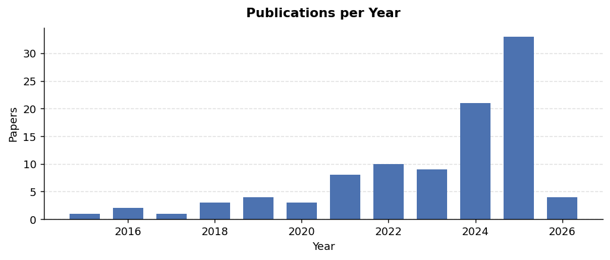
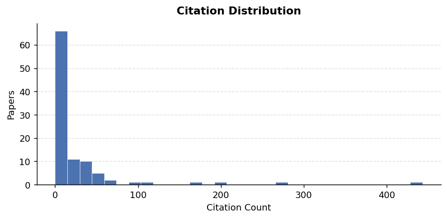
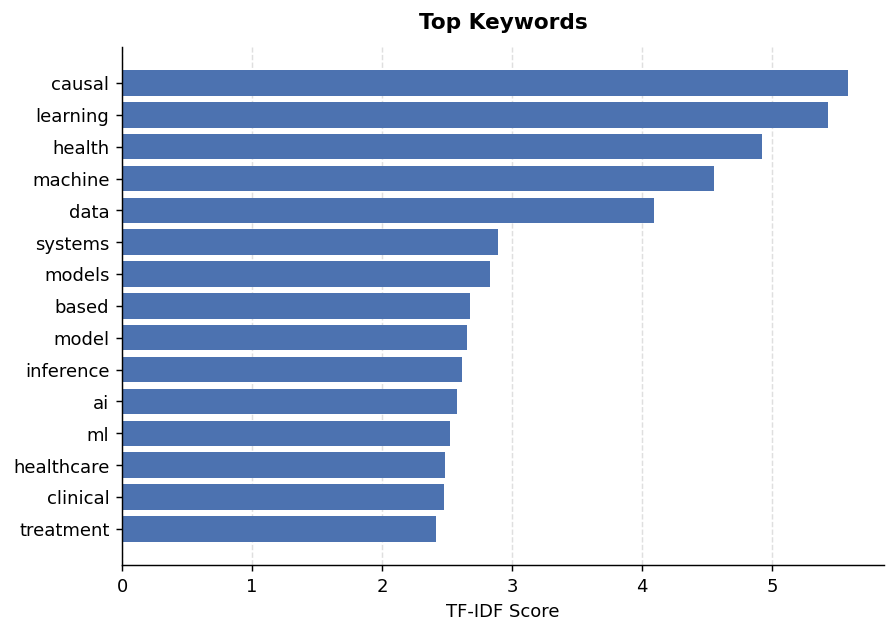

# metaScholar Literature Snapshot

**Query:** `causal machine learning for health systems`

## Overview

- **Number of papers:** 100
- **Year range:** 2015–2026
- **Citations (median / max):** 6.0 / 443.0

## Top Keywords

| Rank | Term | Score |
|------|------|-------|
| 1 | causal | 5.5804 |
| 2 | learning | 5.4306 |
| 3 | health | 4.9218 |
| 4 | machine | 4.5509 |
| 5 | data | 4.0884 |
| 6 | systems | 2.8950 |
| 7 | models | 2.8317 |
| 8 | based | 2.6798 |
| 9 | model | 2.6539 |
| 10 | inference | 2.6128 |
| 11 | ai | 2.5729 |
| 12 | ml | 2.5194 |
| 13 | healthcare | 2.4871 |
| 14 | clinical | 2.4728 |
| 15 | treatment | 2.4151 |
| 16 | prediction | 2.3495 |
| 17 | care | 2.2379 |
| 18 | analysis | 2.2279 |
| 19 | methods | 2.2021 |
| 20 | research | 2.1193 |

## Top Authors

| Rank | Author | # Papers |
|------|--------|----------|
| 1 | Jingjing He | 2 |
| 2 | D. Galatro | 2 |
| 3 | Rosario Trigo-Ferre | 2 |
| 4 | M. Jeffrey | 2 |
| 5 | M. Jacome | 2 |
| 6 | V. Costanzo-Álvarez | 2 |
| 7 | Pedro Sanchez | 2 |
| 8 | J. Voisey | 2 |
| 9 | Tian Xia | 2 |
| 10 | Hannah Watson | 2 |
| 11 | Alison Q. O'Neil | 2 |
| 12 | S. Tsaftaris | 2 |
| 13 | Zhongyuan Liang | 2 |
| 14 | A. Suresh | 2 |
| 15 | Irene Y. Chen | 2 |

## Top Journals / Venues

| Rank | Journal / Venue | # Papers |
|------|------------------|----------|
| 1 | bioRxiv | 2 |
| 2 | Water Research | 2 |
| 3 | npj Digital Medicine | 2 |
| 4 | IEEE journal of biomedical and health informatics | 2 |
| 5 | arXiv.org | 2 |
| 6 | AAAI/ACM Conference on AI, Ethics, and Society | 2 |
| 7 | International Journal of Environmental Research and Public Health | 2 |
| 8 | Health Services Research | 2 |
| 9 | International Conference on Machine Learning | 1 |
| 10 | Science Advances | 1 |

## Recommended First Reads

- **Causal machine learning for predicting treatment outcomes** (2024.0) — citations: 279, score: 0.724

  Causal machine learning (ML) offers flexible, data-driven methods for predicting treatment outcomes including efficacy and toxicity, thereby supporting the assessment and safety of drugs. A key benefit of causal ML is that it allows for estimating individualized treatment effects, so that clinical decision-making can be personalized to individual patient profiles. Causal ML can be used in combination with both clinical trial data and real-world data, such as clinical registries and electronic health records, but caution is needed to avoid biased or incorrect predictions. In this Perspective, we discuss the benefits of causal ML (relative to traditional statistical or ML approaches) and outline the key components and steps. Finally, we provide recommendations for the reliable use of causal ML and effective translation into the clinic. Causal machine learning methods could be used to predict treatment outcomes for subgroups and even individual patients; this Perspective outlines the potential benefits and limitations of the approach, offering practical guidance for appropriate clinical use.

  [Semantic Scholar](https://www.semanticscholar.org/paper/05865f65c46fc557199a535bb5addff911c4cc60)

- **Artificial intelligence, machine learning and health systems** (2018.0) — citations: 443, score: 0.636

  Artificial Intelligence and machine learning have the potential to be the catalyst for transformation of health systems to improve efficiency and effectiveness, create headroom for universal health coverage and improve outcomes

  [Semantic Scholar](https://www.semanticscholar.org/paper/561b15685fb900593f43ac8f7e615a73bb4ff965)

- **Causal machine learning for healthcare and precision medicine** (2022.0) — citations: 204, score: 0.548

  Causal machine learning (CML) has experienced increasing popularity in healthcare. Beyond the inherent capabilities of adding domain knowledge into learning systems, CML provides a complete toolset for investigating how a system would react to an intervention (e.g. outcome given a treatment). Quantifying effects of interventions allows actionable decisions to be made while maintaining robustness in the presence of confounders. Here, we explore how causal inference can be incorporated into different aspects of clinical decision support systems by using recent advances in machine learning. Throughout this paper, we use Alzheimer’s disease to create examples for illustrating how CML can be advantageous in clinical scenarios. Furthermore, we discuss important challenges present in healthcare applications such as processing high-dimensional and unstructured data, generalization to out-of-distribution samples and temporal relationships, that despite the great effort from the research community remain to be solved. Finally, we review lines of research within causal representation learning, causal discovery and causal reasoning which offer the potential towards addressing the aforementioned challenges.

  [Semantic Scholar](https://www.semanticscholar.org/paper/2926c879967beb108dfdee854a91b811d0f96950)

- **Artificial Intelligence and Big Data in Predicting and Managing Obesity‑Associated Diabetes** (2026.0) — citations: 1, score: 0.501

  Artificial intelligence (AI) and big data are reshaping how we understand, predict, and manage obesity‑associated type 2 diabetes (T2D). The diabesity phenotype arises from heterogeneous interactions among genes, behaviors, environments, and health‑care systems. At scale, routinely collected data electronic health records (EHRs), pharmacy claims, continuous glucose monitoring (CGM), wearables, meal logs, imaging, multi‑omics, and social determinants of health (SDOH) capture this complexity but are noisy, incomplete, and biased. Modern machine‑learning (ML) methods can transform these substrates into actionable insights: predicting incident T2D and complications; detecting subclinical trajectories; stratifying patients into mechanistic endotypes; recommending individualized nutrition, activity, and pharmacotherapy; and monitoring for relapse or adverse events. Time‑series deep learning, survival modeling, graph neural networks, and causal inference frameworks enable robust forecasting and counterfactual reasoning, while reinforcement learning (RL) personalizes dynamic regimens. However, translation hinges on trustworthy data engineering, external validation, calibration, explainability, privacy, and equity. Federated learning and differential privacy protect data; fairness auditing and participatory design mitigate bias; and MLOps governs monitoring, drift detection, and post‑deployment updates. Integrating AI into clinical workflows requires human‑in‑the‑loop decision support, interoperable standards, and pragmatic evaluation focused on outcomes that matter to patients and systems. This review synthesizes the data foundations, predictive analytics, digital phenotyping, and decision‑support paradigms relevant to diabesity; outlines implementation, safety, and governance requirements; and maps a path toward multimodal, foundation‑model–enabled “digital twins” that couple physiology with behavior to modify disease trajectories. Done well, AI augments not replaces clinicians and patients, enabling earlier intervention, precise therapy matching, and durable cardiometabolic risk reduction.

Keywords: machine learning; continuous glucose monitoring; digital phenotypes; federated learning; precision diabetes care

  [Semantic Scholar](https://www.semanticscholar.org/paper/5be26b326dce7791a0206d38369c1aed4e10e7f5)

- **Causal machine learning with interpretability deciphers the impact of micropollutants and socioeconomic factors on ARGs in Chinese urban drinking water.** (2026.0) — citations: 1, score: 0.501

  The widespread co-occurrence of antibiotic resistance genes (ARGs) with diverse micropollutants in drinking water distribution systems poses a critical public health threat by potentially facilitating ARG dissemination, yet the underlying causal drivers remain poorly understood. In this study, we employed H2O automated machine learning to profile ARGs and nearly 100 micropollutants, alongside socioeconomic indicators, in drinking water samples collected from 67 Chinese cities. Moving beyond traditional correlation and interpretability analyses, we adopted double machine learning (DML), a causal inference framework, to quantified causal effects (CATE) and elucidate pollutant-ARG relationships. Results revealed synergistic effects among major ARG types (e.g., sul1, tetB and blaTEM), with integron genes (intI1, intI2) serving as key genetic vectors. Antibiotics (e.g., Sulfaphenazole) and PAHs (e.g., Acenaphthene) significantly drove the proliferation of ARGs, while PCBs (e.g., Perfluoro-n-dodecanoic acid) and advanced urban development generally suppressed their prevalence, with GDP exhibiting a nonlinear U-shaped association in detail. The integration of interpretable machine learning with DML effectively deciphered these intricate relationships. Our findings provide new causal insights into ARGs drivers in drinking water and supports evidence-based risk assessment and targeted strategies to mitigate antimicrobial resistance dissemination via water systems.

  [Semantic Scholar](https://www.semanticscholar.org/paper/65e769db32071683d2c3130f18abae3b2ce174be)

- **Beyond GDP: national intelligence quotient as a catalyst for sustainable socioeconomic welfare** (2026.0) — citations: 0, score: 0.500

  [Semantic Scholar](https://www.semanticscholar.org/paper/67aa1651b00ab010b72f03723ebd9d7a3806135e)

- **Mechanistic insights into sulfamethoxazole removal in activated sludge systems through machine learning and microcosm experiments.** (2026.0) — citations: 0, score: 0.500

  Antibiotic residues in wastewater pose serious ecological and public health risks and may even induce the more severe threat of antimicrobial resistance (AMR). The activated sludge (AS) processes, the backbone of global wastewater treatment, play a central role in mitigating these risks. However, antibiotic removal in AS systems remains highly variable and mechanistically unclear. Here, sulfamethoxazole (SMX) was selected as a representative antibiotic to develop a comprehensive machine learning (ML)-based framework for identifying key factors and elucidating process-level mechanisms governing SMX biodegradation in AS processes using an integrated dataset from lab-, pilot-, and full-scale systems. The random forest regression (RFR) model outperformed other models and achieved the highest predictive performance (testing R² = 0.83) after full-factor grid optimization, 5-fold cross-validation and feature engineering, with strong generalization confirmed by independent (prediction error < 20 %). Feature attribution, dependency, and causal analyses revealed that process control parameters (43 %) dominated SMX removal, followed by influent (30 %) and process performance parameters (27 %). Key factors including acclimation period (AP), pH, influent SMX, and ammonia nitrogen (NH4+-N) were identified, with threshold values (15 days, 7.3-8.0, 0.2 mg/L, 43 mg/L) revealed for the first time using the RFR model. Model-identified threshold-like effects of influent SMX concentration and AP governed the initiation of biodegradation, while influent NH4+-N regulated SMX removal via co-metabolism. Causal inference further indicated that NH4+-N removal rate was a stronger performance indicator of AS processes for SMX biodegradation than COD removal rate. The 60-day microcosm validation confirmed that the RFR-guided acclimation achieved near 100 % SMX removal (0.2 mg/L-10 mg/L) and supported the biological plausibility of the model-inferred threshold-like behavior, providing mechanistically informed insights beyond model. This framework integrates data-driven prediction with mechanistic understanding, providing a generalizable approach and offering actionable guidance for optimizing AS processes to mitigate antibiotic pollution.

  [Semantic Scholar](https://www.semanticscholar.org/paper/2ea9cf57c96e8ee00a1de73431eabc8645c35428)

- **A machine learning approach to leveraging electronic health records for enhanced omics analysis** (2025.0) — citations: 37, score: 0.496

  Omics studies produce a large number of measurements, enabling the development, validation and interpretation of systems-level biological models. Large cohorts are required to power these complex models; yet, the cohort size remains limited due to clinical and budgetary constraints. We introduce clinical and omics multimodal analysis enhanced with transfer learning (COMET), a machine learning framework that incorporates large, observational electronic health record databases and transfer learning to improve the analysis of small datasets from omics studies. By pretraining on electronic health record data and adaptively blending both early and late fusion strategies, COMET overcomes the limitations of existing multimodal machine learning methods. Using two independent datasets, we showed that COMET improved the predictive modelling performance and biological discovery compared with the analysis of omics data with traditional methods. By incorporating electronic health record data into omics analyses, COMET enables more precise patient classifications, beyond the simplistic binary reduction to cases and controls. This framework can be broadly applied to the analysis of multimodal omics studies and reveals more powerful biological insights from limited cohort sizes. COMET, an artificial intelligence method that improves the analysis of small medical studies using large clinical databases, has been created. COMET can help develop better artificial intelligence tools and identify key biomarkers across many diseases, potentially changing medical research.

  [Semantic Scholar](https://www.semanticscholar.org/paper/369b19b2dfd727fe98909bd66ab4a852c987ceed)

- **Artificial intelligence (AI) and machine learning (ML) based decision support systems in mental health: An integrative review.** (2023.0) — citations: 113, score: 0.491

  An integrative review investigating the incorporation of artificial intelligence (AI) and machine learning (ML) based decision support systems in mental health care settings was undertaken of published literature between 2016 and 2021 across six databases. Four studies met the research question and the inclusion criteria. The primary theme identified was trust and confidence. To date, there is limited research regarding the use of AI-based decision support systems in mental health. Our review found that significant barriers exist regarding its incorporation into practice primarily arising from uncertainty related to clinician's trust and confidence, end-user acceptance and system transparency. More research is needed to understand the role of AI in assisting treatment and identifying missed care. Researchers and developers must focus on establishing trust and confidence with clinical staff before true clinical impact can be determined. Finally, further research is required to understand the attitudes and beliefs surrounding the use of AI and related impacts for the wellbeing of the end-users of care. This review highlights the necessity of involving clinicians in all stages of research, development and implementation of artificial intelligence in care delivery. Earning the trust and confidence of clinicians should be foremost in consideration in implementation of any AI-based decision support system. Clinicians should be motivated to actively embrace the opportunity to contribute to the development and implementation of new health technologies and digital tools that assist all health care professionals to identify missed care, before it occurs as a matter of importance for public safety and ethical implementation. AI-basesd decision support tools in mental health settings show most promise as trust and confidence of clinicians is achieved.

  [Semantic Scholar](https://www.semanticscholar.org/paper/57378828bf5f22c479ad03a9897bf6cb7737662a)

- **Privacy-Preserving Edge Federated Learning for Intelligent Mobile-Health Systems** (2024.0) — citations: 65, score: 0.482

  Machine Learning (ML) algorithms are generally designed for scenarios in which all data is stored in one data center, where the training is performed. However, in many applications, e.g., in the healthcare domain, the training data is distributed among several entities, e.g., different hospitals or patients' mobile devices/sensors. At the same time, transferring the data to a central location for learning is certainly not an option, due to privacy concerns and legal issues, and in certain cases, because of the communication and computation overheads. Federated Learning (FL) is the state-of-the-art collaborative ML approach for training an ML model across multiple parties holding local data samples, without sharing them. However, enabling learning from distributed data over such edge Internet of Things (IoT) systems (e.g., mobile-health and wearable technologies, involving sensitive personal/medical data) in a privacy-preserving fashion presents a major challenge mainly due to their stringent resource constraints, i.e., limited computing capacity, communication bandwidth, memory storage, and battery lifetime. In this paper, we propose a privacy-preserving edge FL framework for resource-constrained mobile-health and wearable technologies over the IoT infrastructure. We evaluate our proposed framework extensively and provide the implementation of our technique on Amazon's AWS cloud platform based on the seizure detection application in epilepsy monitoring using wearable technologies.

  [Semantic Scholar](https://www.semanticscholar.org/paper/da665034a4597ef463e1163d21610cdf26819e6d)

## Most Cited Papers

- **Artificial intelligence, machine learning and health systems** (2018.0) — citations: 443
  - https://www.semanticscholar.org/paper/561b15685fb900593f43ac8f7e615a73bb4ff965
- **Causal machine learning for predicting treatment outcomes** (2024.0) — citations: 279
  - https://www.semanticscholar.org/paper/05865f65c46fc557199a535bb5addff911c4cc60
- **Causal machine learning for healthcare and precision medicine** (2022.0) — citations: 204
  - https://www.semanticscholar.org/paper/2926c879967beb108dfdee854a91b811d0f96950
- **Information fusion as an integrative cross-cutting enabler to achieve robust, explainable, and trustworthy medical artificial intelligence** (2021.0) — citations: 174
  - https://www.semanticscholar.org/paper/1d243b2371bdef69d07f1312d0b18162b05788a0
- **Artificial intelligence (AI) and machine learning (ML) based decision support systems in mental health: An integrative review.** (2023.0) — citations: 113
  - https://www.semanticscholar.org/paper/57378828bf5f22c479ad03a9897bf6cb7737662a
- **Mapping of machine learning approaches for description, prediction, and causal inference in the social and health sciences** (2022.0) — citations: 101
  - https://www.semanticscholar.org/paper/72c042ce96c70c963a9040340e71940f3cb7b076
- **Privacy-Preserving Edge Federated Learning for Intelligent Mobile-Health Systems** (2024.0) — citations: 65
  - https://www.semanticscholar.org/paper/da665034a4597ef463e1163d21610cdf26819e6d
- **Advancing Predictive Risk Assessment of Chemicals via Integrating Machine Learning, Computational Modeling, and Chemical/Nano‐Quantitative Structure‐Activity Relationship Approaches** (2024.0) — citations: 62
  - https://www.semanticscholar.org/paper/d1008f701689cad14c994d016ffd45f8c8655e28
- **Machine Learning, Health Disparities, and Causal Reasoning** (2018.0) — citations: 54
  - https://www.semanticscholar.org/paper/7373afec3b5f87f9f0dfe9aed0e0be9a38a9e1c7
- **Deep biomarkers of aging and longevity: from research to applications** (2019.0) — citations: 53
  - https://www.semanticscholar.org/paper/262e82c514d24aaf3cd446921ae3ca37b21d6961

## Most Recent Papers

- **Mechanistic insights into sulfamethoxazole removal in activated sludge systems through machine learning and microcosm experiments.** (2026.0) — citations: 0
  - https://www.semanticscholar.org/paper/2ea9cf57c96e8ee00a1de73431eabc8645c35428
- **Causal machine learning with interpretability deciphers the impact of micropollutants and socioeconomic factors on ARGs in Chinese urban drinking water.** (2026.0) — citations: 1
  - https://www.semanticscholar.org/paper/65e769db32071683d2c3130f18abae3b2ce174be
- **Artificial Intelligence and Big Data in Predicting and Managing Obesity‑Associated Diabetes** (2026.0) — citations: 1
  - https://www.semanticscholar.org/paper/5be26b326dce7791a0206d38369c1aed4e10e7f5
- **Beyond GDP: national intelligence quotient as a catalyst for sustainable socioeconomic welfare** (2026.0) — citations: 0
  - https://www.semanticscholar.org/paper/67aa1651b00ab010b72f03723ebd9d7a3806135e
- **Unraveling global malaria incidence and mortality using machine learning and artificial intelligence–driven spatial analysis** (2025.0) — citations: 6
  - https://www.semanticscholar.org/paper/f9c62d36aa05fa1ef957aae7525f733fd3d9b877
- **Satellite Remote Sensing-Implemented Nontargeted Screening of Emerging Contaminant Fingerprints in a River-to-Ocean Continuum through Interpretable Machine Learning: The Pivotal Intermediary Role of Dissolved Organic Matter.** (2025.0) — citations: 6
  - https://www.semanticscholar.org/paper/f4ff0b708ec25ff2a5af2707c9c451968c7325d5
- **Random Survival Forest Machine Learning for the Prediction of Cardiovascular Events Among Patients With a Measured Lipoprotein(a) Level: A Model Development Study** (2025.0) — citations: 2
  - https://www.semanticscholar.org/paper/e71dcc496d3c4b509da10c5e31ed1dd7f4c2e05b
- **Expanding care coordination in an integrated health system through causal machine learning** (2025.0) — citations: 1
  - https://www.semanticscholar.org/paper/c20ffac6df75e727ab624508d14c031516e44451
- **Machine Learning Models for Monitoring Environmental Impact on Public Health** (2025.0) — citations: 0
  - https://www.semanticscholar.org/paper/ae11f395657812f3e9d7818af6fc2c93283de2f9
- **Integration of Explainable Artificial Intelligence into Hybrid Long Short-Term Memory and Adaptive Kalman Filter for Sulfur Dioxide (SO2) Prediction in Kimberley, South Africa** (2025.0) — citations: 9
  - https://www.semanticscholar.org/paper/a1747ec8a5416c634b977d76a66dcee86c4c5e25

---
_Generated by metaScholar._
